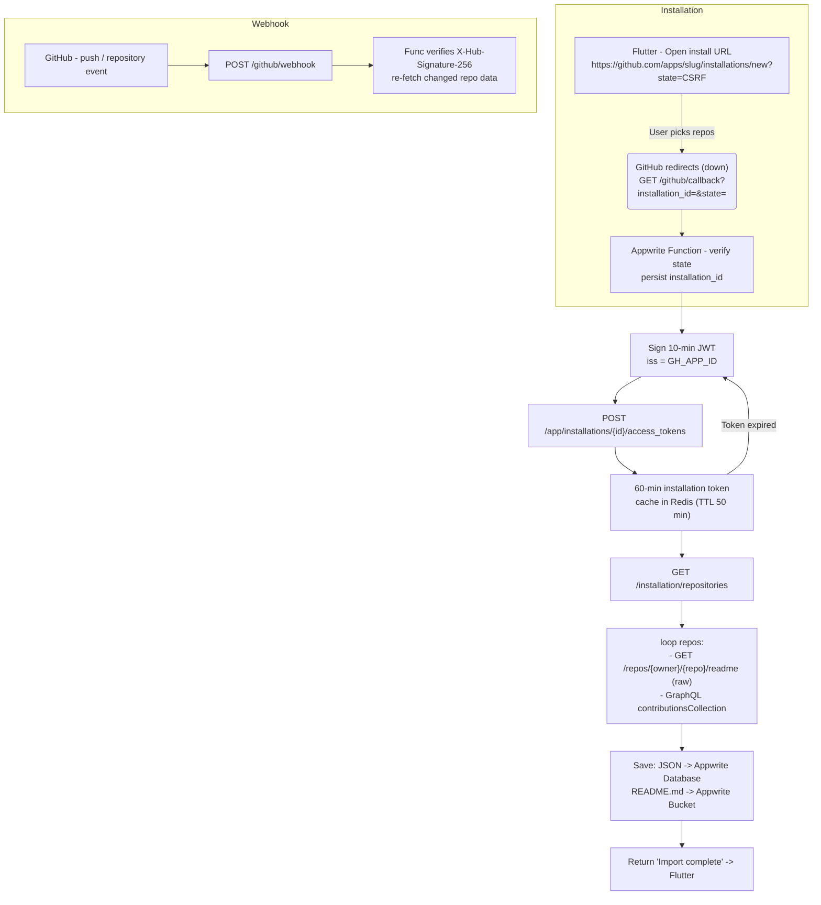

```mermaid
graph TD
    subgraph Installation
        A["Flutter - Open install URL\nhttps://github.com/apps/slug/installations/new?state=CSRF"] -->|User picks repos| B("GitHub redirects (down)\nGET /github/callback?\ninstallation_id=&state=")
        B --> C["Appwrite Function - verify state\npersist installation_id"]
    end
    C --> D["Sign 10-min JWT\niss = GH_APP_ID"]
    D --> E["POST /app/installations/{id}/access_tokens"]
    E --> F["60-min installation token\ncache in Redis (TTL 50 min)"]
    F --> G["GET /installation/repositories"]
    G --> H["loop repos:\n- GET /repos/{owner}/{repo}/readme (raw)\n- GraphQL contributionsCollection"]
    H --> I["Save: JSON -> Appwrite Database\nREADME.md -> Appwrite Bucket"]
    I --> J["Return 'Import complete' -> Flutter"]
    F -->|Token expired| D
    subgraph Webhook
        K["GitHub - push / repository event"] --> L["POST /github/webhook"]
        L --> M["Func verifies X-Hub-Signature-256\nre-fetch changed repo data"]
    end
```

